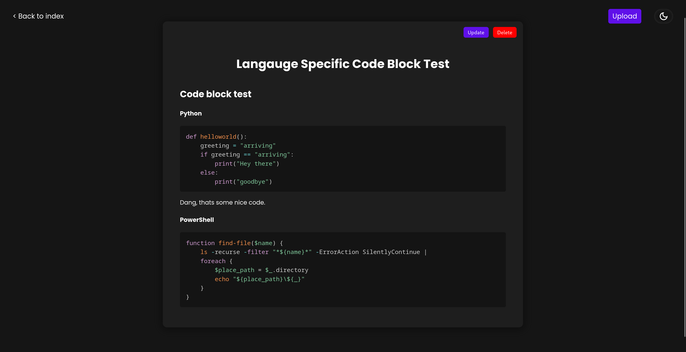
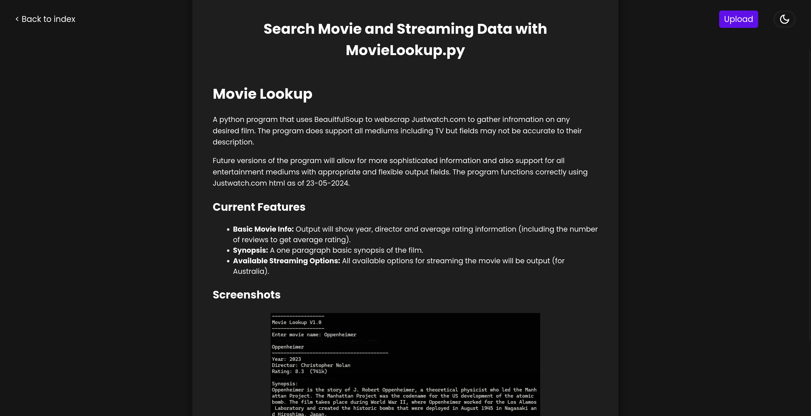
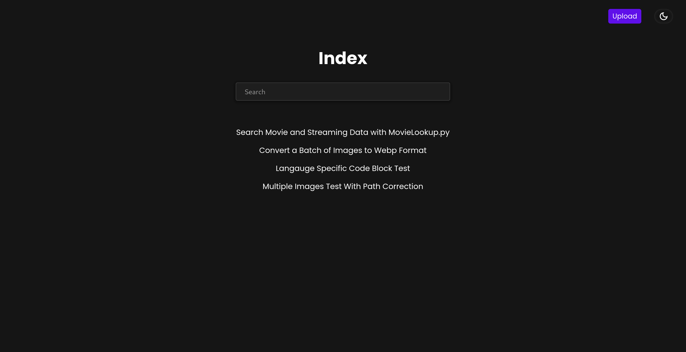
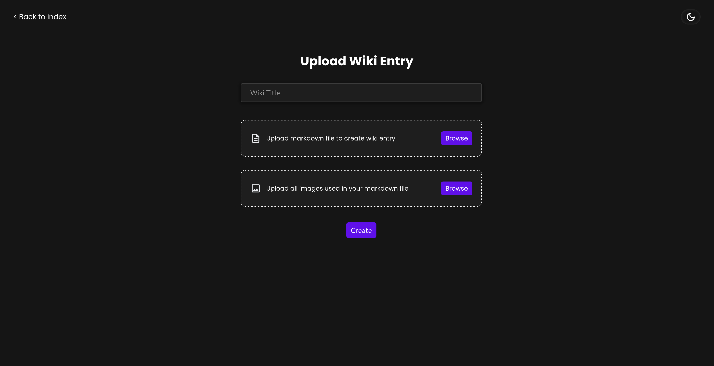

# Easy Wiki
Easy Wiki is a Django app used to create a plug and play wiki environment that is lightweight and can be used anywhere. Easy Wiki utilises markdown files to generate wiki entries automatically, including language specific code syntax highlighting. You can also update, delete or download files seamlessly with auto cleanup for updated files.

## Features
- Easy upload of Markdown files to create formatted wiki entries
- Language specific code syntax highlighting
- Update entries easily by uploading a new Markdown file
- Download entries back into Markdown format to edit or keep
- Search functionailty and categories/tags 

## Prerequisites
The only prequisite required is to have Python3 installed. All other dependencies can be pip installed from the requirements.txt file. See setup below.

## Set Up
Once you have downloaded the source folder from this repository move into the root localwiki directory where manage.py and requirements.txt are installed. The installed the required python packages using requirements.txt.

```
pip install requirements.txt
```
Once all the python packages have been installed you can start running the app locally using Django. 

```
python3 manage.py runserver
```
Django will run the app on your lcoal host at: 127.0.0.1:8000. Navigate to this address and add /wiki to the end of the address.

```
127.0.0.1:8000/wiki
```

## Non-local Use
Of course this app can be used for non-local/online use if you require it. Just follow normal Django deployment practices. 

## Screenshots





## Additional Notes
Easy Wiki is still very much a work in progress. There may be bug or errors that occur during use. If you encounter any errors, bugs or security concerns please raise an issue here. 

There will also be more features and qaulity of life upgrades being brought to the app very soon. Star the project to stay updated. 
